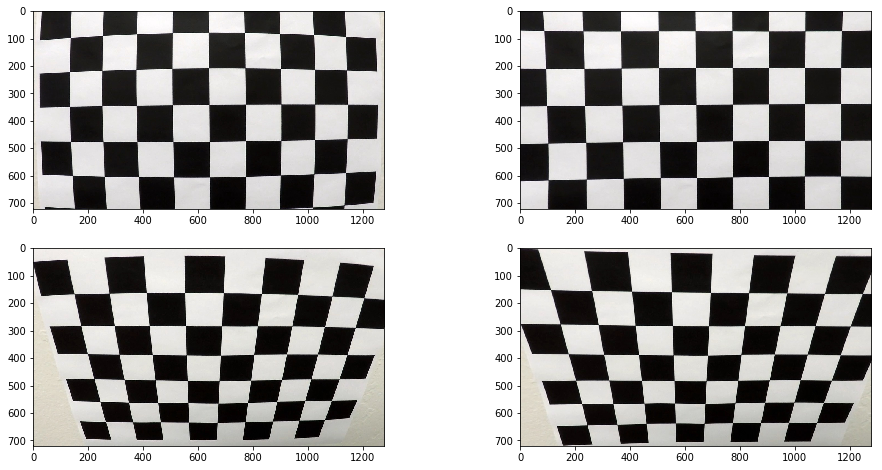
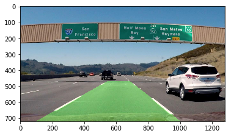

**Advanced Lane Finding Project**

The goals / steps of this project are the following:

* Compute the camera calibration matrix and distortion coefficients given a set of chessboard images.
* Apply a distortion correction to raw images.
* Use color transforms, gradients, etc., to create a thresholded binary image.
* Apply a perspective transform to rectify binary image ("birds-eye view").
* Detect lane pixels and fit to find the lane boundary.
* Determine the curvature of the lane and vehicle position with respect to center.
* Warp the detected lane boundaries back onto the original image.
* Output visual display of the lane boundaries and numerical estimation of lane curvature and vehicle position.

### Writeup / README

#### 1. Provide a Writeup / README that includes all the rubric points and how you addressed each one.  You can submit your writeup as markdown or pdf.  [Here](https://github.com/udacity/CarND-Advanced-Lane-Lines/blob/master/writeup_template.md) is a template writeup for this project you can use as a guide and a starting point.  

You're reading it!

### Camera Calibration

#### 1. Briefly state how you computed the camera matrix and distortion coefficients. Provide an example of a distortion corrected calibration image.

The code for this step is contained in the first code cell of the IPython notebook located in "./line-finder.ipynb".  

I start by preparing "object points", which will be the (x, y, z) coordinates of the chessboard corners in the world. Here I am assuming the chessboard is fixed on the (x, y) plane at z=0, such that the object points are the same for each calibration image.  Thus, `objp` is just a replicated array of coordinates, and `objpoints` will be appended with a copy of it every time I successfully detect all chessboard corners in a test image.  `imgpoints` will be appended with the (x, y) pixel position of each of the corners in the image plane with each successful chessboard detection.  

I then used the output `objpoints` and `imgpoints` to compute the camera calibration and distortion coefficients using the `cv2.calibrateCamera()` function.  I applied this distortion correction to the test image using the `cv2.undistort()` function and obtained this result: 



### Pipeline (single images)

#### 1. Provide an example of a distortion-corrected image.

The pipeline I used was the pipelined defined in the class material; I applied camera calibration, camera distortion, image transformation, binary filtering, lane calculation, drawing the lane, the debugging text, and then applying a perspective transform on the inverse matrix. Again, everything defined in the course material. Nothing new.

I found the image perspective numbers through the course forums and through trial and error.

```python
top_left_src = [570, 468]
top_right_src = [714, 468]
bottom_right_src = [1106, 720]
bottom_left_src = [207, 720]

top_left_dst = [320, 1]
top_right_dst = [920, 1]
bottom_right_dst = [920, 720]
bottom_left_dst = [320, 720]
```

After applying the pipeline to a test image we can see that everything is working.



### Pipeline (video)

#### 1. Provide a link to your final video output.  Your pipeline should perform reasonably well on the entire project video (wobbly lines are ok but no catastrophic failures that would cause the car to drive off the road!).

Here's a [link to my video result](./project_video_output.mp4)

---

### Discussion

#### 1. Briefly discuss any problems / issues you faced in your implementation of this project.  Where will your pipeline likely fail?  What could you do to make it more robust?

I didn't face many issues. I did have two problems.

 - The lane highlight was curving in the wrong direction. 
   - This was fixed by applying a better binary image generator. I ended up combining the Lightness and Saturation layers to fix this.
 - The lane highlight was a bit wobbly.
   - Using the suggested ```Line``` class helped fix this by keeping track of previous points.

The rest of the project was simply following the course material and piping it together.
